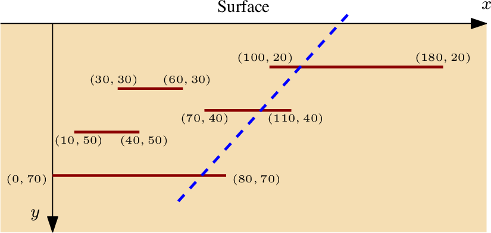

**L3 Informatique -- Programmation efficace**

## Puits de pétrole

Vous travaillez pour une compagnie pétrolière et êtes chargés d'optimiser
les forages. Après des décennies d'exploitation, le forage devient de
plus en plus difficile : les nouveaux gisements découverts sont souvent
fractionnés, ce qui affecte la productivité des puits. On vous demande de
considérer le cas des gisements _stratifiés_, c'est-à-dire formés de
plusieurs sous-gisements à différentes profondeurs. Vous commencez par
étudier un modèle simplifié à 2 dimensions, où les différents gisements
sont modélisés par des segments parallèles à la surface comme sur l'image
ci-dessous :

{ width=70% }

Vous devez déterminer comment forer un unique puits en maximisant sa
production. Le forage se fait impérativement selon une unique ligne
droite, et on suppose que le pétrole de chaque gisement traversé par le
puits pourra être intégralement extrait (y compris si l'intersection est
à l'extrémité du gisement). La capacité de chaque gisement est assimilée
à sa largeur.


##### Entrée 

Les instances sont fournies dans des fichiers au format suivant : 
```bash
n           # nombre de gisements de pétrole
x01 x11 y1  # coordonnées du premier gisement : de (x01, y1) à (x11, y1)
x02 x12 y2  # coordonnées du deuxième gisement : de (x02, y2) à (x12, y2)
...
x0n x1n yn  # coordonnées du n-ième gisement : de (x0n, yn) à (x1n, yn)
```

Bornes sur les paramètres : 1 ≤ `n` ≤ 2000, `x0i`, `x1i` ≤ 10^6, 1 ≤ `yi` ≤ 10^6.
Les gisements ne s'intersectent pas entre eux (même aux extrémités).

##### Sortie

Le fichier de sortie est constitué d'une seule ligne contenant la capacité
d'extraction maximale d'un puits.

##### Exemples

Pour le fichier d'entrée suivant :
```bash
5
100 180 20
30 60 30
70 110 40
10 40 50
0 80 70
```
la sortie attendue est
```bash
200
```

alors que pour le fichier d'entrée
```bash
3
50 60 10
-42 -42 20
25 0 10
```
la sortie attendue est
```bash
25
```

